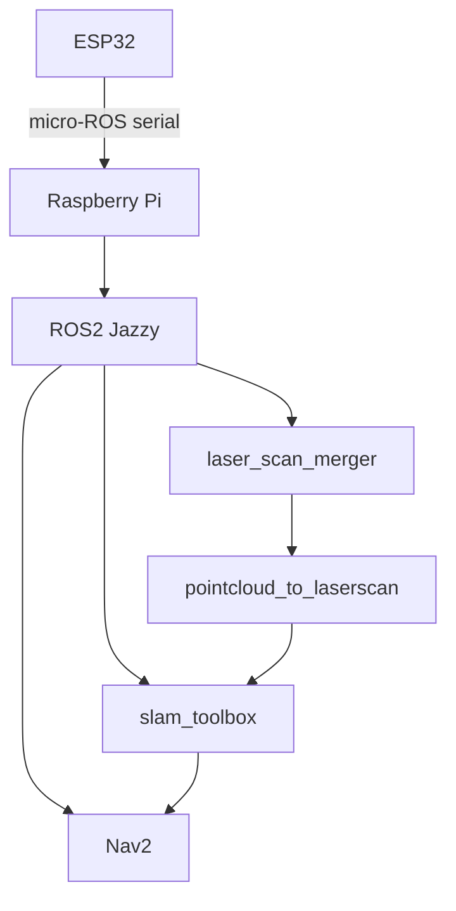

# My ROS2 Robot Project

{ width="600" }

## Overview
A differential drive robot with full SLAM and autonomous navigation 
built on ROS2 Jazzy, running on Raspberry Pi with ESP32 motor controller.

## Key Features
- 360° laser scan from dual VL53L0X sensors merged via `ros2_laser_scan_merger`
- Full Nav2 stack with MPPI controller
- Hardware E-stop with GPIO watchdog
- micro-ROS over serial for ESP32 communication

## Architecture

## Quick Links
- [GitHub Repo](https://github.com/wutyeeoo/husarion_ugv_autonomy_ros)
- [Hardware Design](hardware/overview.md)
- [Nav2 Tuning Findings](findings/debugging.md)
